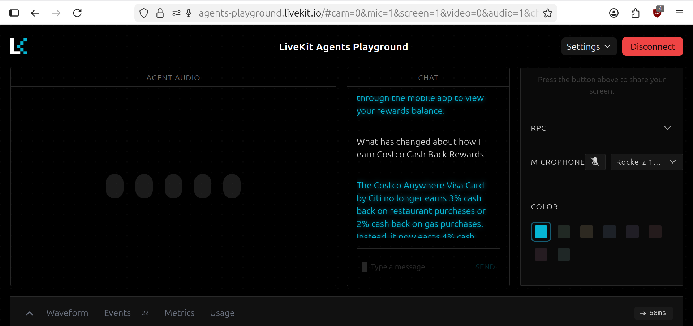

# Setup

so First cloned the repo:
https://github.com/livekit-examples/voice-pipeline-agent-python

```bash
cd voice-pipeline-agent-python
python3 -m venv venv
source venv/bin/activate
pip install -r requirements.txt
python3 agent.py download-files
```

After setup, added a RAG system (`rag_chat.py`).

## Changes

* Replaced OpenAI with Groq
* Used Groq for STT + LLM
* Used Cartesia for TTS


## Screen shot

